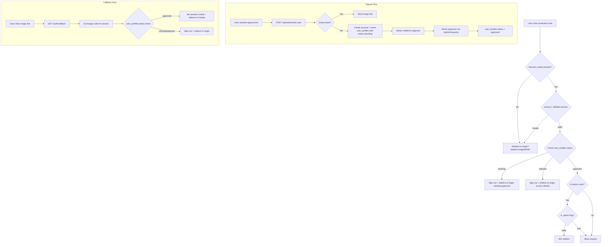
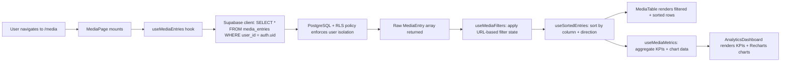
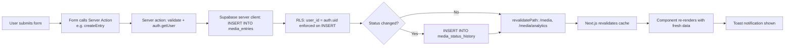
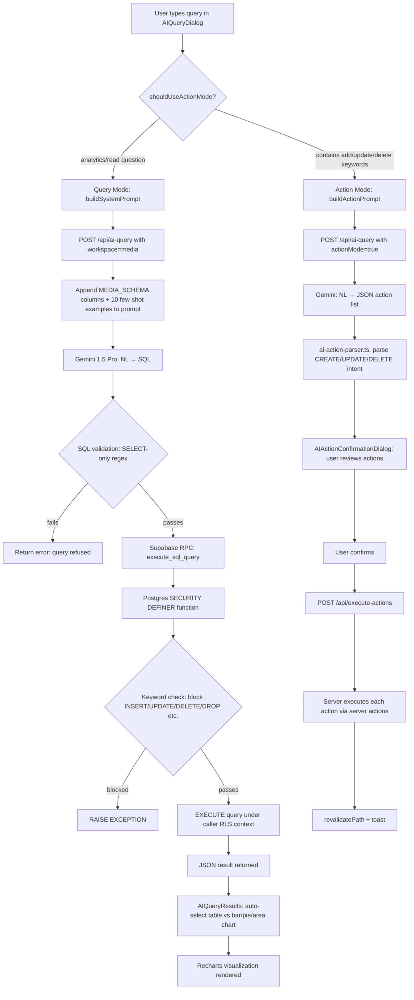
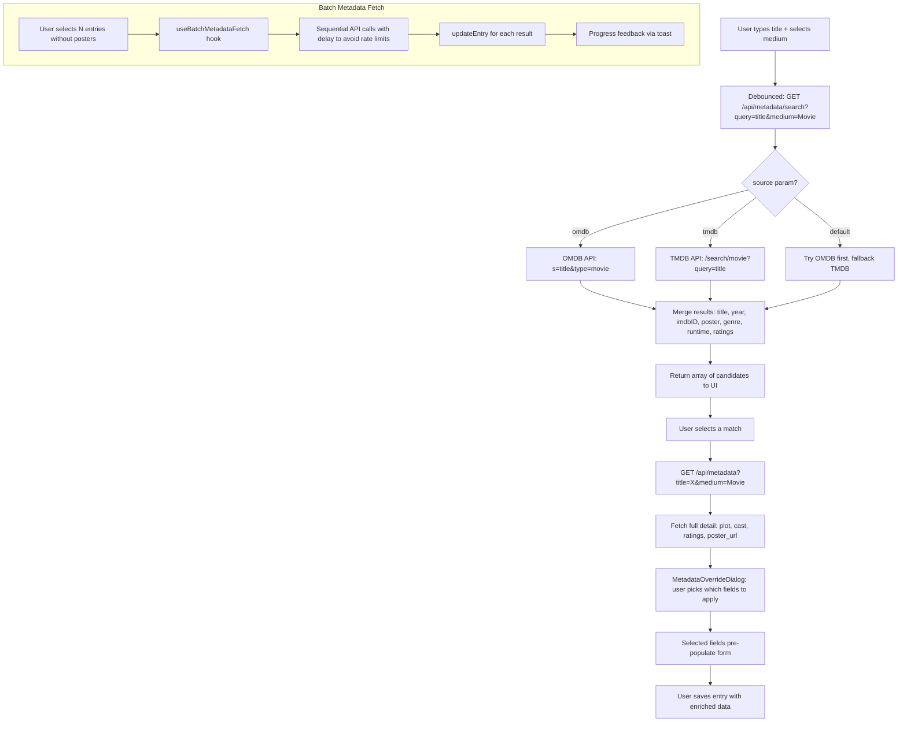

# analythika: A Full-Stack Personal Media Tracking and Analytics Web Application

**Project:** analythika (`analythika`)
**Date:** April 2026
**Repository:** analytics-web
**Technology Stack:** Next.js 16, React 19, TypeScript 5, Supabase (PostgreSQL), Google Gemini AI

---

## Table of Contents

1. [Abstract](#abstract)
2. [Introduction](#introduction)
   - [Background](#background)
   - [Research Questions](#research-questions)
   - [Research Contribution](#research-contribution)
3. [Literature Review](#literature-review)
4. [Methodology](#methodology)
   - [System Design Overview](#system-design-overview)
   - [Authentication and Authorization Flow](#authentication-and-authorization-flow)
   - [Data Flow](#data-flow)
   - [AI Query Pipeline](#ai-query-pipeline)
   - [Metadata Enrichment Pipeline](#metadata-enrichment-pipeline)
5. [Implementation](#implementation)
   - [Technology Stack](#technology-stack)
   - [Database Schema](#database-schema)
   - [Application Architecture](#application-architecture)
   - [Core Modules](#core-modules)
6. [Results and Discussion](#results-and-discussion)
7. [Conclusion](#conclusion)
8. [Future Work](#future-work)
9. [References](#references)

---

## Abstract

Media consumption has become a central part of modern life, spanning movies, television series, books, games, podcasts, and live theatre. Despite this, most users lack a unified, personal system for tracking, rating, and analytically reflecting on their consumption habits across all media types. This paper presents **analythika**, a full-stack web application designed to address this gap by providing a comprehensive personal media diary with rich analytics, automated metadata enrichment, and natural-language AI querying. The system is built on Next.js 16 with the App Router, React 19 Server Components, a Supabase-hosted PostgreSQL backend with Row-Level Security (RLS), and Google Gemini for natural-language-to-SQL query generation. analythika enables users to record, filter, and visualize consumption patterns across six distinct media categories — Movie, TV Show, Book, Game, Podcast, and Live Theatre — and to interrogate their own data using plain-English questions. The application implements a secure admin-controlled user approval workflow, episodic watch-progress tracking, bulk CSV import with field mapping, batch metadata fetching from OMDB/TMDB, and a client-side analytics dashboard featuring KPIs and Recharts-powered visualizations. Results demonstrate a coherent, scalable architecture with clean separation between the UI, business logic, and data layers, and a practical implementation of safe AI-driven database access. Future directions include server-side recommendation, social sharing of watchlists, and integration with streaming-platform APIs for automatic watch-history ingestion.

---

## Introduction

### Background

The proliferation of streaming services, digital storefronts, and on-demand content has dramatically increased both the volume and diversity of media that individuals consume. A person may watch a film on Netflix, follow multiple concurrent television series on three different platforms, listen to a podcast during their commute, read a novel on a Kindle, play a video game on a console, and attend a live theatre performance in the same month — all without a single system to record, rate, or reflect on these experiences.

Existing solutions are fragmented. IMDb allows users to rate movies but does not track games or podcasts. Goodreads is dedicated to books. Letterboxd is exclusively for films. Steam tracks game playtime but has no integration with passive media. No mainstream tool unifies all media types under a single personal analytics workspace. Beyond simple logging, users lack the ability to ask analytical questions — "How much have I spent on media this year?" or "What genre do I rate highest?" — without manually exporting data to spreadsheets.

**analythika** was built to close this gap: a single, self-hosted personal media diary that captures any media type, enriches records with external metadata, and provides both visual analytics and a conversational AI query interface, all secured behind a per-user Row-Level Security model that guarantees complete data isolation.

### Research Questions

This project is guided by four primary research questions:

1. **RQ1 — Unified Tracking:** Can a single relational data model effectively represent the heterogeneous properties of movies, television series, books, games, podcasts, and live theatre while remaining extensible for future media types?

2. **RQ2 — AI-Assisted Analytics:** Is it practical to use a large language model (Google Gemini) to translate arbitrary natural-language questions into safe, correct PostgreSQL queries over a personal media dataset, with acceptable accuracy and acceptable security guarantees?

3. **RQ3 — Architecture Scalability:** Does a Next.js App Router application backed by Supabase — with server actions for mutations and client-side hooks for data fetching — provide a coherent and maintainable layered architecture for a feature-dense personal-data application?

4. **RQ4 — User Security:** Can an admin-controlled approval workflow combined with database-level Row-Level Security provide adequate user isolation and access control for a multi-user deployment?

### Research Contribution

This project makes the following contributions:

- **A unified media entry data model** (`media_entries`) that supports Movies, TV Shows, Books, Games, Podcasts, and Live Theatre in a single PostgreSQL table with typed arrays for multi-value attributes (genres, languages) and a JSONB column for fine-grained episode watch history.

- **A natural-language analytics interface** built on Google Gemini, which generates SELECT-only PostgreSQL queries validated at both the application layer and inside a `SECURITY DEFINER` stored procedure, enabling safe AI-driven data introspection without exposing write access.

- **A full-stack reference implementation** using Next.js 16 App Router, React 19 Server Components, TypeScript 5, Supabase (Auth + PostgreSQL + Storage), TanStack Table, and Recharts — demonstrating how these technologies compose into a production-grade personal-data application.

- **A secure multi-user architecture** that combines Supabase Auth (magic-link) with a proxy-layer approval gate (`proxy.ts`), an admin panel for user lifecycle management, and Postgres RLS policies ensuring zero cross-user data leakage.

---

## Literature Review

### Personal Informatics and Self-Tracking

Li et al. (2010) introduced the framework of *personal informatics* — systems that help people collect and reflect on personal data to gain self-knowledge. Their stage-based model (preparation, collection, integration, reflection, action) maps directly onto the design goals of analythika: users prepare by defining what media types to track, collect through manual entry or CSV import, integrate through automated metadata enrichment, reflect via the analytics dashboard, and act by updating watch statuses or planning new content.

Choe et al. (2014) and Rooksby et al. (2014) identified key challenges in self-tracking: entry friction, motivation decay, and the difficulty of deriving insight from raw logs. analythika addresses entry friction through one-click metadata autofill (OMDB/TMDB), bulk CSV import, and a natural-language AI interface that eliminates the need to write queries manually.

### Media Recommendation and Consumption Tracking

Existing recommendation systems (Koren et al., 2009; He et al., 2017) typically operate on implicit or explicit rating signals collected by platforms. However, cross-platform personal tracking — which is what analythika enables — is a substantially different problem. The user controls all data, enabling analyses that no single platform can perform: total spend across all media types per month, average personal rating versus average public rating by genre, or time taken to complete media relative to medium.

Prior work on personal media libraries includes MyAnimeList (MAL), which pioneered the status-based tracking model (Watching, Completed, On Hold, Dropped, Plan to Watch) later replicated by services like AniList. analythika adopts and extends this model to all media types, adding `Currently Watching` and `Planned` as additional states, and persisting every status transition in a dedicated `media_status_history` table with optional notes.

### Natural Language Interfaces to Databases

Natural language interfaces to databases (NLIDBs) have been studied since the 1970s (Androutsopoulos et al., 1995). The emergence of large language models (LLMs) has dramatically lowered the cost of implementing NLIDBs. Rajkumar et al. (2022) demonstrated that GPT-3 family models can generate correct SQL for complex multi-table queries when provided an accurate schema description. Guo et al. (2019) introduced the IRNet architecture for cross-domain text-to-SQL.

analythika leverages Google Gemini 1.5 Pro as the NL-to-SQL backend. The system prompt precisely describes the `media_entries` schema including column types, value examples, and array handling conventions (`UNNEST` for `genre[]` and `language[]`). Ten example question–SQL pairs are embedded in the prompt to guide few-shot generation. All generated queries are validated client-side (SELECT-only regex) and then executed inside the `execute_sql_query` Postgres function, which enforces a second layer of keyword-based restriction and inherits the calling user's RLS context.

### Full-Stack Web Application Architecture

The move to React Server Components (RSC) and the Next.js App Router has changed the conventional wisdom on where to place data-fetching logic. Vercel (2023) advocates a model where server components fetch data directly and pass props to interactive client components, reducing client-side JavaScript bundles. analythika adopts this pattern for the analytics dashboard (server-fetched metadata, client-rendered charts) and uses Next.js Server Actions — introduced in Next.js 14 and stabilized in Next.js 16 — for all mutation operations, eliminating a separate REST mutation layer for CRUD operations.

Supabase as a backend platform has been widely adopted as a Firebase alternative with Postgres semantics and RLS-based security (Supabase, 2023). Its SSR helpers (`@supabase/ssr`) provide seamless session management across server and client components, which is particularly important in the App Router model where request context does not flow automatically between rendering environments.

### Security in Multi-User Personal Data Applications

Narayanan and Shmatikova (2006) demonstrated that anonymized datasets can be de-anonymized by cross-referencing with public information, highlighting the importance of strict data isolation in multi-user systems. analythika's RLS policies at the database level mean that even a programming error in the application layer cannot expose one user's entries to another — the database itself enforces isolation. The admin approval gate (pending → approved → rejected lifecycle) prevents unauthorized access to the application before a user has been explicitly granted access by an administrator.

---

## Methodology

### System Design Overview

analythika follows a **three-tier, feature-layered architecture** organized as follows:

```
┌─────────────────────────────────────────────────────────────────┐
│                     Presentation Layer                          │
│  app/ (Next.js App Router pages) + components/ (React UI)      │
├─────────────────────────────────────────────────────────────────┤
│                  Business Logic Layer                           │
│  lib/actions.ts · hooks/ · lib/filter-types.ts                 │
│  lib/ai-query-schemas.ts · lib/services/                       │
├─────────────────────────────────────────────────────────────────┤
│                     Data Access Layer                           │
│  lib/supabase/ (server + client) · app/api/ (REST endpoints)   │
├─────────────────────────────────────────────────────────────────┤
│                       External Layer                            │
│  Supabase (PostgreSQL + Auth + Storage) · OMDB · TMDB · Gemini │
└─────────────────────────────────────────────────────────────────┘
```

The layered separation ensures that UI components never directly access the database or external APIs; all data flows through either server actions (mutations) or custom hooks and API routes (reads and external calls).

### Authentication and Authorization Flow

The authentication flow combines Supabase Auth (email magic-link), a proxy layer for session validation, and a `user_profiles` table for approval state.



**Key security properties:**

- Session validation occurs at the network proxy layer (`proxy.ts`) on every non-public GET request, before any page component renders.
- The `SUPABASE_SERVICE_ROLE_KEY` is used exclusively server-side (API routes, admin server actions) and is never exposed to the browser.
- Admin routes (`/admin/*`) are protected by a secondary check against the `is_admin` boolean in `user_profiles`, enforced both in `proxy.ts` and inside every admin server action via `checkIsAdmin()`.

### Data Flow

#### Reading Data (Media Entries)



The hook-based architecture means that a single fetch populates both the diary table and the entire analytics dashboard. Filter state is synchronized with URL search parameters, enabling shareable filtered views.

#### Writing Data (Create / Update / Delete)



### AI Query Pipeline

The AI query system allows users to type plain-English questions and receive either tabular results or auto-selected chart visualizations.



**Safety model:** The two-layer validation (application regex + Postgres function keyword check) ensures that even a prompt-injection attack that causes Gemini to generate a destructive query cannot succeed — the stored procedure refuses execution before the query reaches the planner.

### Metadata Enrichment Pipeline

When a user types a title and selects a medium, the application can automatically fetch poster, IMDB rating, release year, genre, and runtime from external APIs.



---

## Implementation

### Technology Stack

| Category | Technology | Version | Role |
|---|---|---|---|
| Framework | Next.js | 16.1.1 | App Router, Server Actions, API routes, image optimization |
| UI Library | React | 19.2.3 | Server Components, Client Components, concurrent features |
| Language | TypeScript | 5.7.2 | End-to-end type safety |
| Database | Supabase (PostgreSQL) | — | Persistent storage, RLS, Auth, file storage |
| Auth | Supabase Auth | — | Email magic-link authentication |
| Styling | Tailwind CSS | 3.4.17 | Utility-first styling |
| Component primitives | Radix UI | — | Accessible Dialog, Dropdown, Select, Tabs, Popover |
| Table | TanStack Table | 8.21.3 | Sorting, column visibility, virtual scroll |
| Charts | Recharts | 3.6.0 | Bar, pie, area, line charts |
| AI | Google Generative AI | — | Gemini 1.5 Pro for NL-to-SQL and action parsing |
| CSV parsing | PapaParse | 5.4.1 | Client-side CSV import |
| Date utilities | date-fns | 4.1.0 | Date formatting, range calculations |
| Icons | lucide-react | — | Icon set |
| Toasts | sonner | — | Toast notifications |
| Carousel | embla-carousel-react | — | Image carousel in detail view |
| Image crop | react-easy-crop | — | User-uploaded image cropping |
| HEIC conversion | heic-to | — | iOS HEIC format support for uploads |
| Package manager | Bun | — | Dependency management and script runner |
| Bundler | Turbopack | (built-in) | Fast development builds |
| Linter | ESLint | — | Code quality enforcement |

### Database Schema

#### `media_entries`

The core table stores one row per media item per user. Multi-value attributes (genres, languages) are stored as PostgreSQL arrays (`text[]`), enabling efficient unnesting for GROUP BY analytics. Episode watch history is stored as JSONB for flexible schema evolution.

| Column | Type | Nullable | Description |
|---|---|---|---|
| `id` | uuid | NOT NULL | Primary key, auto-generated |
| `user_id` | uuid | NOT NULL | Foreign key → `auth.users` |
| `title` | text | NOT NULL | Title of the media item |
| `medium` | text | nullable | Movie · TV Show · Book · Game · Podcast · Live Theatre |
| `type` | text | nullable | Sub-type: Documentary · Variety · Reality · Scripted · Animation · Special · Audio |
| `status` | text | nullable | Finished · Watching · Currently Watching · On Hold · Dropped · Plan to Watch · Planned |
| `genre` | text[] | nullable | Array of genre strings |
| `language` | text[] | nullable | Array of language strings |
| `platform` | text | nullable | Netflix · Disney+ · Steam · Cinema · etc. |
| `start_date` | date | nullable | Date consumption began |
| `finish_date` | date | nullable | Date consumption completed |
| `my_rating` | numeric | nullable | Personal rating (0–10 scale) |
| `average_rating` | numeric | nullable | External/public average rating |
| `rating` | numeric | nullable | Legacy general rating field |
| `price` | numeric | nullable | Cost paid (any currency) |
| `length` | text | nullable | Runtime or page count, e.g. "148 min", "12h 30m" |
| `episodes` | integer | nullable | Total episode count (TV Shows) |
| `episodes_watched` | integer | nullable | Episodes watched so far |
| `episode_history` | jsonb | nullable | Array of `{episode: number, watched_at: string}` records |
| `last_watched_at` | timestamp | nullable | Timestamp of most recent watch event |
| `poster_url` | text | nullable | External or storage URL for poster image |
| `imdb_id` | text | nullable | IMDb identifier (e.g. `tt1375666`) |
| `season` | text | nullable | Season label (e.g. `Season 1`) |
| `time_taken` | text | nullable | Duration from start to finish (computed or stored) |
| `created_at` | timestamp | NOT NULL | Row creation timestamp |
| `updated_at` | timestamp | NOT NULL | Last modification timestamp |

RLS policies enforce `auth.uid() = user_id` on all four operations (SELECT, INSERT, UPDATE, DELETE), ensuring complete per-user isolation at the database layer.

#### `media_status_history`

Every status transition for any entry is appended to this table, enabling a timeline view of how a user's engagement with a piece of media evolved (e.g., Started → On Hold → Resumed → Finished).

| Column | Type | Description |
|---|---|---|
| `id` | uuid | Primary key |
| `media_entry_id` | uuid | FK → `media_entries.id` |
| `user_id` | uuid | FK → `auth.users` |
| `old_status` | text | Status before the change |
| `new_status` | text | Status after the change |
| `changed_at` | timestamp | When the change occurred |
| `notes` | text | Optional user notes about the transition |
| `created_at` | timestamp | Row creation timestamp |

#### `user_profiles`

| Column | Type | Description |
|---|---|---|
| `id` | uuid | Primary key |
| `user_id` | uuid | FK → `auth.users` (unique) |
| `email` | text | User email address |
| `status` | text | `pending` · `approved` · `rejected` |
| `is_admin` | boolean | Admin access flag |
| `requested_at` | timestamp | When the user requested access |
| `approved_at` | timestamp | When an admin approved the user |
| `approved_by` | uuid | FK → the approving admin |
| `rejection_reason` | text | Reason provided on rejection |

#### `user_preferences`

| Column | Type | Description |
|---|---|---|
| `id` | uuid | Primary key |
| `user_id` | uuid | FK → `auth.users` |
| `preference_key` | text | Preference name (e.g. `column_visibility`) |
| `preference_value` | jsonb | Preference value |

#### Database Functions

**`execute_sql_query(query_text TEXT) RETURNS JSON`**

A `SECURITY DEFINER` function that executes a caller-supplied SQL string. Before execution, it:
1. Verifies the query starts with `SELECT` (case-insensitive).
2. Scans for a blocklist of destructive keywords (`INSERT`, `UPDATE`, `DELETE`, `DROP`, `ALTER`, `CREATE`, `TRUNCATE`, `GRANT`, `REVOKE`).
3. Runs the query inside the caller's RLS context (the user can only see their own rows).
4. Returns results as a JSON array.

**`is_admin() RETURNS boolean`**

Returns `true` if the currently authenticated user has `is_admin = true` in `user_profiles`. Used in RLS policies and server action guards.

### Application Architecture

The application is organized into four layers with clear dependency direction: Presentation → Business Logic → Data Access → External.

```
app/
├── page.tsx                        ← Landing/marketing page
├── login/page.tsx                  ← Authentication page
├── auth/callback/route.ts          ← Magic-link exchange + approval check
├── media/
│   ├── page.tsx                    ← Media diary (main workspace)
│   └── analytics/page.tsx          ← Analytics dashboard
├── admin/
│   ├── page.tsx                    ← Admin overview
│   ├── users/page.tsx              ← User management
│   └── requests/page.tsx           ← Pending approval queue
└── api/
    ├── auth/check-user/route.ts    ← Email existence + approval check
    ├── metadata/route.ts           ← OMDB/TMDB enrichment
    ├── metadata/search/route.ts    ← Title search
    ├── omdb/route.ts               ← Direct OMDB proxy
    ├── upload/route.ts             ← Image upload → Supabase Storage
    ├── ai-query/route.ts           ← NL → SQL via Gemini
    ├── execute-actions/route.ts    ← AI-generated action execution
    └── clean-data/route.ts         ← Data normalization
```

**Route redirects** (configured in `next.config.ts`) permanently redirect legacy paths to the canonical `/media` workspace: `/movies → /media`, `/entries → /media`, `/library → /media`, `/watching → /media/watching`.

### Core Modules

#### 1. Media Entry CRUD (`lib/actions.ts`)

All mutations are implemented as Next.js Server Actions — asynchronous functions that run exclusively on the server and are called directly from client components without a manual fetch layer. The key operations are:

- **`createEntry(data)`** — Inserts a new row into `media_entries`, injecting the authenticated `user_id` server-side. Calls `revalidatePath` for `/media` and `/media/analytics` to invalidate the Next.js cache.
- **`updateEntry(id, data)`** — Patches an existing entry. If `status` is included in `data` and differs from the current value, a status history record is automatically appended.
- **`deleteEntry(id)`** — Removes the entry and cascades to its status history.
- **`getEntries(options)`** — Fetches all entries for the authenticated user. Optionally excludes `Book` medium (for backwards compatibility). Supports ordering by `updated_at` descending.
- **`batchUpdateEntries(ids, data)`** — Applies the same field updates to multiple entries simultaneously.
- **`getEntryStats()`** — Returns aggregate counts, total spend, and rating summaries for the current user.

Each server action validates the caller's session via `supabase.auth.getUser()` before any database operation, providing application-level authentication on top of database-level RLS.

#### 2. Episode Tracker

TV Show entries support per-episode tracking beyond a simple count. The `episode_history` JSONB column stores an ordered array of `EpisodeWatchRecord` objects:

```typescript
interface EpisodeWatchRecord {
  episode: number;
  watched_at: string; // ISO timestamp
}
```

The `EpisodeTracker` component renders a grid of episode badges. Clicking a badge marks or unmarks that episode as watched and appends a timestamped record to `episode_history`. The `episodes_watched` integer column is kept in sync and `last_watched_at` is updated to the most recent watch timestamp, enabling the "Watching" section on the main media page to sort by recency of activity.

#### 3. Status History Timeline

Whenever an entry's `status` field changes — whether via the details dialog, the batch edit panel, or the AI action engine — a record is inserted into `media_status_history`. The `StatusHistoryTimeline` component renders these records as a vertical timeline inside the media details dialog, giving users a chronological view of their engagement with a title (e.g., "Started watching → Put on hold → Resumed → Finished").

#### 4. Metadata Enrichment (`lib/services/omdb.ts`, `lib/services/tmdb.ts`)

The metadata pipeline provides two external sources:

- **OMDB API** — Accessed via the server-side `/api/metadata` route using `OMDB_API_KEY`. Returns title, year, genre, runtime, IMDb rating, plot, and poster URL. Best suited for Movies and TV Shows with strong IMDb coverage.
- **TMDB API** — Accessed via `/api/metadata?source=tmdb`. Returns more detailed metadata including overview, backdrop images, and TMDB-specific IDs. The `WatchThisDialog` component uses TMDB specifically to fetch a plot synopsis for planned items.

The `MetadataOverrideDialog` gives users granular control over which fetched fields (poster, genre, rating, length, etc.) should overwrite their manually-entered data, preventing unintended information loss.

**Batch metadata fetch** (`useBatchMetadataFetch` hook) allows users to select multiple entries and fetch metadata for all of them sequentially, with built-in delay between requests to respect API rate limits and progress feedback via toast notifications.

#### 5. Analytics Dashboard

The analytics system uses a **client-side aggregation** model: raw entries are fetched once from Supabase, then all metrics are derived in the browser using the `useMediaMetrics` hook. This approach keeps the server simple (a single SELECT query) while allowing instantaneous filter updates without additional network round-trips.

`useMediaMetrics` produces the following aggregations from the `MediaEntry[]` input:

- **KPI metrics:** Total entry count, total time spent (parsing the `length` field for "148 min" / "12h 30m" formats), total money spent (sum of `price`), average personal rating, rating distribution histogram.
- **Counts by dimension:** Breakdown of entries by `medium`, `language` (unnested from array), `genre` (unnested), `platform`, `status`, and `type`.
- **Monthly trends:** Spending per month, time consumption per month, entries finished per month — all bucketed by `finish_date`.
- **Rating comparison:** Personal `my_rating` versus external `average_rating` per medium type.

All of these aggregations are filtered by the active `FilterState`, which is maintained in URL search parameters by `useMediaFilters`. When a user changes a filter, the URL updates, `useMediaMetrics` re-computes over the filtered subset, and all KPIs and charts update simultaneously — no loading states required.

The `GlobalFilterBar` component provides multi-select filter controls for Medium, Status, Platform, Language, Genre, and a date range picker for `start_date` / `finish_date`. Filter state serializes to URL parameters, making filtered views fully shareable via link.

Charts are rendered using Recharts components wrapped in thin, reusable primitives: `SimpleBarChart`, `SimplePieChart`, and `AreaChartBase`. Chart types are chosen by data shape: distributions use `SimplePieChart`, time-series use `AreaChartBase`, and categorical breakdowns use `SimpleBarChart`.

#### 6. AI Query Engine (`app/api/ai-query/route.ts`, `lib/ai-query-schemas.ts`)

The AI query engine exposes two modes, selected automatically by the `shouldUseActionMode()` heuristic:

**Query Mode** (analytics questions):
The route constructs a system prompt containing the full `media_entries` schema (column names, types, example values) and ten few-shot example question–SQL pairs, then calls `gemini-1.5-pro` with the user's question. The returned JSON `{sql, explanation}` is validated for SELECT-only syntax, then passed to `execute_sql_query` via Supabase RPC. Results are returned to the client where `AIQueryResults` selects an appropriate visualization.

Example question–SQL pairs embedded in the prompt include:
- *"What movies did I watch in 2025?"* → SELECT with `EXTRACT(YEAR FROM start_date::date) = 2025`
- *"Average rating by genre"* → UNNEST on `genre[]` with AVG aggregation
- *"How many hours did I spend watching TV this month?"* → Complex CASE expression parsing the `length` text field

**Action Mode** (create/update/delete requests):
When the user's input contains keywords like "add", "mark as finished", "delete", or "to planned", the `buildActionPrompt` is used instead. Gemini returns a structured JSON object:

```json
{
  "type": "action",
  "intent": "Add films to planned watchlist",
  "actions": [
    {"type": "create", "data": {"title": "Dune Part 3", "status": "Planned", "medium": "Movie"}}
  ]
}
```

The `AIActionConfirmationDialog` presents these parsed actions to the user before execution, providing a human-in-the-loop safety gate. Only after confirmation does `POST /api/execute-actions` apply the changes via the standard server actions layer, which enforces all the same RLS and authentication constraints as manual CRUD operations.

#### 7. CSV Import (`components/import/`, `lib/csv-parser.ts`)

Users can bulk-import entries from CSV files. The import flow proceeds as follows:

1. **Upload** — `ImportFileUpload` accepts `.csv` files or paste; PapaParse parses client-side.
2. **Field mapping** — `ImportPreviewTable` shows a preview with detected columns; users map CSV headers to `media_entries` schema fields.
3. **Validation** — `csv-parser.ts` normalizes dates, trims strings, validates medium/status values against the canonical option lists.
4. **Batch insert** — Valid rows are submitted via `batchCreateEntries` server action. Errors are reported per-row without aborting the entire import.

A format guide (`ImportFormatGuide`) documents the expected CSV column names and value formats, lowering the barrier for users migrating from spreadsheets or other tracking tools.

#### 8. Column Preferences (`hooks/useColumnPreferences.ts`)

The `MediaTable` built on TanStack Table supports user-configurable column visibility. Column preferences are persisted in both `localStorage` (for immediate availability) and the `user_preferences` Supabase table (for cross-device synchronization). The `useColumnPreferences` hook reconciles these two sources, with the database value taking precedence when both are present.

#### 9. Batch Edit (`components/shared/BatchEditDialog.tsx`)

Users can select multiple entries in the table and apply the same field values to all of them simultaneously. The `BatchEditDialog` exposes a subset of fields appropriate for bulk editing (status, platform, genre, language, rating). The `batchUpdateEntries` server action applies the update atomically, and `revalidatePath` ensures the UI refreshes without manual page reload.

---

## Results and Discussion

### Feature Completeness

The implementation successfully delivers all core features defined in the system requirements:

| Feature | Status | Key Module |
|---|---|---|
| Multi-medium tracking (6 types) | Delivered | `media_entries.medium`, `lib/types.ts` |
| Status lifecycle with history | Delivered | `media_status_history`, `StatusHistoryTimeline` |
| Episode-level tracking for TV Shows | Delivered | `episode_history` JSONB, `EpisodeTracker` |
| OMDB/TMDB metadata enrichment | Delivered | `/api/metadata`, `MetadataOverrideDialog` |
| Batch metadata fetch | Delivered | `useBatchMetadataFetch` |
| CSV bulk import | Delivered | `ImportFileUpload`, `csv-parser.ts` |
| Batch edit | Delivered | `BatchEditDialog`, `batchUpdateEntries` |
| Analytics dashboard (KPIs + charts) | Delivered | `useMediaMetrics`, Recharts components |
| URL-synchronized multi-criteria filters | Delivered | `useMediaFilters`, `GlobalFilterBar` |
| AI natural-language query (SELECT) | Delivered | `/api/ai-query`, `execute_sql_query` |
| AI action mode (create/update/delete) | Delivered | `buildActionPrompt`, `AIActionConfirmationDialog` |
| Dark/light theme | Delivered | `theme-provider.tsx`, Tailwind dark mode |
| Admin user approval workflow | Delivered | `admin-actions.ts`, `/admin/requests` |
| Column visibility preferences | Delivered | `useColumnPreferences` |
| Shareable filtered views (URL params) | Delivered | `useMediaFilters` → `URLSearchParams` |
| Poster images with fallback emoji | Delivered | `SafeImage`, `getPlaceholderPoster` |
| Responsive design | Delivered | Tailwind responsive classes |
| Skeleton loading states | Delivered | `skeletons.tsx` |

### Architecture Evaluation

**Separation of concerns:** The layered architecture is well maintained. UI components do not import Supabase directly — they call server actions or custom hooks. Server actions do not render JSX. External API calls are isolated in `app/api/` routes and `lib/services/`. This makes each layer independently testable and replaceable.

**Next.js Server Actions vs. REST:** Using server actions for mutations eliminates a significant amount of boilerplate compared to a traditional REST API: no `fetch`, no JSON serialization, no API route for each mutation, and no client-side state management for pending/success/error states (these are replaced by the action's return value pattern `ActionResponse<T>`). The `revalidatePath` calls in each action ensure that Next.js's server-side cache is invalidated immediately, so the UI always reflects the latest database state.

**Client-side analytics aggregation:** Deriving all analytics in the browser after a single `SELECT *` query is elegant and avoids the need for complex server-side GROUP BY queries across many dimensions. However, it scales linearly with the number of entries: for a user with thousands of entries, the in-browser aggregation remains fast (pure JavaScript array operations), but the initial network payload grows. For very large datasets, server-side pre-aggregation or pagination would be needed.

**AI query safety:** The two-layer validation (application-level regex + Postgres stored procedure) provides robust protection against destructive AI-generated queries. The few-shot examples in the system prompt significantly improve SQL correctness for common question patterns (date filtering, array unnesting, rating aggregations). The action confirmation dialog prevents accidental data modification from ambiguous natural-language inputs.

**Type safety:** The `lib/database.types.ts` file provides a fully typed `Database` interface covering all table rows and insert/update shapes. Combined with TypeScript 5's strict mode, this catches schema mismatches at compile time. The `ActionResponse<T>` discriminated union pattern (`{success: true, data: T} | {success: false, error: string}`) enables exhaustive error handling at call sites.

**Row-Level Security:** RLS policies on `media_entries`, `media_status_history`, and `user_preferences` ensure that even if an application bug allowed an incorrect `user_id` to reach the database, the RLS policy would silently reject cross-user data access. This defense-in-depth model significantly reduces the blast radius of potential application-layer bugs.

### Limitations

1. **No real-time updates:** Supabase Realtime subscriptions are available but not implemented. In a multi-device scenario, changes made on one device do not appear on another without a page refresh. Adding `supabase.channel().on('postgres_changes', …)` to `useMediaEntries` would address this.

2. **Client-side analytics payload:** For users with hundreds or thousands of entries, the initial `SELECT *` fetch transfers the full dataset to the browser. Pagination or server-side aggregation for the analytics endpoints would improve performance at scale.

3. **AI query accuracy:** The NL-to-SQL pipeline is accurate for the ten example patterns embedded in the prompt but may fail on complex multi-table joins, window functions, or highly ambiguous questions. There is no feedback loop to improve the model's examples over time based on user corrections.

4. **Single-user data model:** Entries are strictly private. There is no sharing, collaboration, or social feature — a user cannot share a watchlist with a friend or compare ratings.

5. **No streaming platform integration:** Platform is stored as a free-text/enum field. The application does not connect to Netflix, Spotify, Steam, or other platform APIs to automatically ingest watch history, meaning all entry creation is manual or via CSV.

---

## Conclusion

analythika demonstrates that a unified personal media tracking application across six distinct media types is both architecturally feasible and practically useful. The central design insight — that Movies, TV Shows, Books, Games, Podcasts, and Live Theatre can share a single relational table with type-specific nullable columns and JSONB for extensible structured data — proves effective: the schema accommodates all media types without separate tables while retaining full relational query capabilities.

The integration of Google Gemini for natural-language-to-SQL query generation brings conversational analytics to personal data, enabling non-technical users to ask questions about their media consumption without writing a single line of SQL. The two-layer safety model (application regex + Postgres stored procedure) provides confidence that this AI integration cannot cause data loss or unauthorized access, even under adversarial prompting conditions.

The choice of Next.js 16 App Router with Server Actions, React 19 Server Components, and Supabase as the backend platform is validated by the implementation: the layered architecture is clean, type-safe end-to-end, and requires remarkably little infrastructure for a feature-rich application. The admin-controlled user approval workflow and database-level RLS together provide a robust multi-user security model suitable for a shared deployment.

The project directly answers its research questions: RQ1 (unified model) is addressed by the `media_entries` schema; RQ2 (AI analytics) is addressed by the Gemini pipeline with two-layer SQL safety; RQ3 (architectural scalability) is addressed by the clean four-layer architecture and Server Actions pattern; and RQ4 (user security) is addressed by the proxy gate, approval workflow, and RLS policies.

---

## Future Work

1. **Streaming Platform API Integration:** Connect to official developer APIs (Spotify for podcasts, Steam for games, Trakt.tv for films/TV) to automatically ingest watch/play history, eliminating the need for manual entry and reducing tracking friction.

2. **Server-Side Recommendations:** Implement a collaborative filtering or content-based recommendation engine using the accumulated ratings data. A simple item-item similarity model over the `media_entries` table could surface "users who rated X highly also rated Y highly" suggestions.

3. **Social and Sharing Features:** Allow users to publish selected watchlists, diary excerpts, or top-rated lists as public or shared-link pages, enabling social comparison without compromising the default private-by-default data model.

4. **Offline-First Support:** Implement a service worker with IndexedDB caching for the media diary, allowing read access and entry creation when offline, with background sync to Supabase when connectivity is restored.

5. **Progressive Web App (PWA):** Package the application as a PWA with a home screen icon and push notifications for episode release reminders or "you haven't updated this entry in 30 days" prompts.

6. **AI Recommendation Explanations:** Extend the Gemini integration to generate natural-language explanations of analytics findings — e.g., "Your average rating for films watched on Netflix (7.2) is significantly higher than for films watched on Disney+ (6.1). This may reflect a preference for the type of content Netflix licenses."

7. **Mobile App:** Build a companion React Native / Expo application that shares the same Supabase backend, optimized for quick logging ("just finished a film, rate it now") on mobile devices.

8. **Export and Data Portability:** Implement one-click CSV, JSON, and Letterboxd-compatible export, ensuring users can always retrieve their data in standard formats. This also supports the personal informatics principle that users should own and control their data.

9. **Advanced AI Actions:** Extend the AI action mode to support more complex bulk operations: "Mark all On Hold TV shows from 2024 as Dropped", "Set my rating to 8 for all films I rated 7.5 to 8.5", or "Add all movies directed by Christopher Nolan to my watchlist."

10. **Automated Data Quality:** Extend `api/clean-data` into a scheduled job that normalizes language names (e.g., unifying "Eng", "English", "ENG" → "English"), deduplicates genre strings, and flags entries with missing critical fields, maintaining data quality over time.

---

## References

Androutsopoulos, I., Ritchie, G. D., & Thanisch, P. (1995). Natural language interfaces to databases — an introduction. *Natural Language Engineering*, 1(1), 29–81. https://doi.org/10.1017/S135132490000005X

Choe, E. K., Lee, N. B., Lee, B., Pratt, W., & Kientz, J. A. (2014). Understanding quantified-selfers' practices in collecting and exploring personal data. In *Proceedings of the SIGCHI Conference on Human Factors in Computing Systems (CHI '14)* (pp. 1143–1152). ACM. https://doi.org/10.1145/2556288.2557372

Google. (2024). *Gemini API documentation: Get started with the Gemini API*. Google AI for Developers. https://ai.google.dev/gemini-api/docs

Guo, J., Zhan, Z., Gao, Y., Xiao, Y., Lou, J., Liu, T., & Zhang, D. (2019). Towards complex text-to-SQL in cross-domain database with intermediate representation. In *Proceedings of the 57th Annual Meeting of the Association for Computational Linguistics (ACL 2019)* (pp. 4524–4535). Association for Computational Linguistics. https://doi.org/10.18653/v1/P19-1444

He, X., Liao, L., Zhang, H., Nie, L., Hu, X., & Chua, T.-S. (2017). Neural collaborative filtering. In *Proceedings of the 26th International Conference on World Wide Web (WWW '17)* (pp. 173–182). International World Wide Web Conferences Steering Committee. https://doi.org/10.1145/3038912.3052569

Koren, Y., Bell, R., & Volinsky, C. (2009). Matrix factorization techniques for recommender systems. *IEEE Computer*, 42(8), 30–37. https://doi.org/10.1109/MC.2009.263

Li, I., Dey, A., & Forlizzi, J. (2010). A stage-based model of personal informatics systems. In *Proceedings of the SIGCHI Conference on Human Factors in Computing Systems (CHI '10)* (pp. 557–566). ACM. https://doi.org/10.1145/1753326.1753409

Narayanan, A., & Shmatikova, V. (2006). How to break anonymity of the Netflix prize dataset. *arXiv preprint*. https://arxiv.org/abs/cs/0610105

Next.js. (2024). *Next.js 16 documentation: App Router, Server Actions, and Server Components*. Vercel. https://nextjs.org/docs

PostgreSQL Global Development Group. (2024). *PostgreSQL 16 documentation: Row security policies*. https://www.postgresql.org/docs/16/ddl-rowsecurity.html

Rajkumar, N., Li, R., & Bahdanau, D. (2022). Evaluating the text-to-SQL capabilities of large language models. *arXiv preprint*. https://arxiv.org/abs/2204.00498

Rooksby, J., Rost, M., Morrison, A., & Chalmers, M. (2014). Personal tracking as lived informatics. In *Proceedings of the SIGCHI Conference on Human Factors in Computing Systems (CHI '14)* (pp. 1163–1172). ACM. https://doi.org/10.1145/2556288.2557039

Supabase. (2024). *Supabase documentation: Database, Auth, Row Level Security, and Storage*. https://supabase.com/docs

TanStack. (2024). *TanStack Table v8 documentation*. https://tanstack.com/table/v8/docs

The Movie Database (TMDB). (2024). *TMDB API documentation*. https://developer.themoviedb.org/docs

Vercel. (2024). *React Server Components and the Next.js App Router*. https://vercel.com/blog/understanding-react-server-components

OMDb API. (2024). *The Open Movie Database API documentation*. https://www.omdbapi.com/

---

*End of Report*
